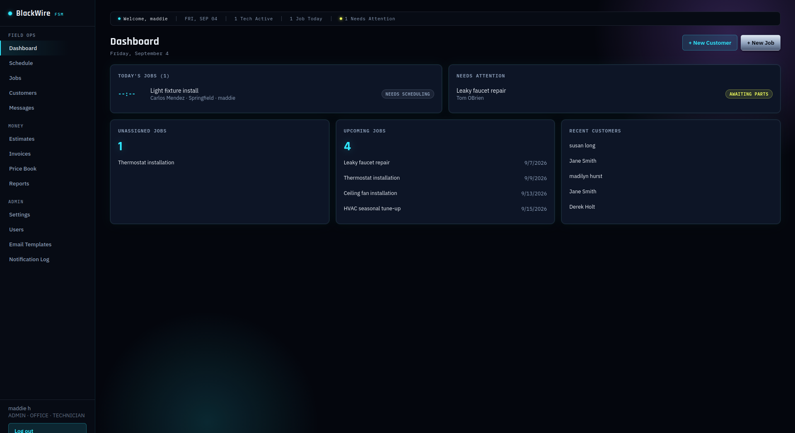
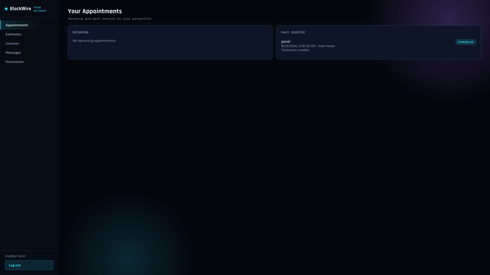
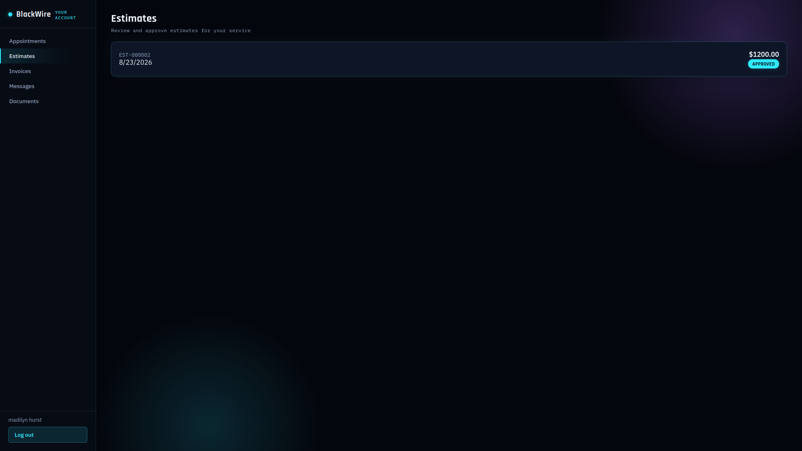
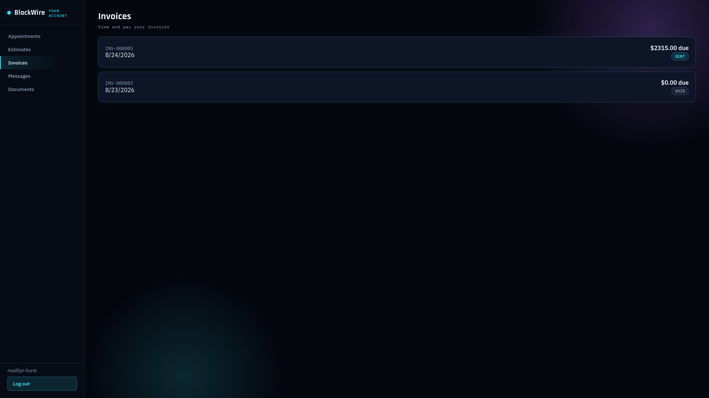
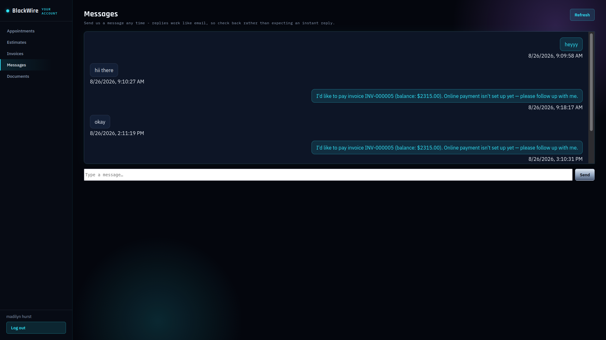
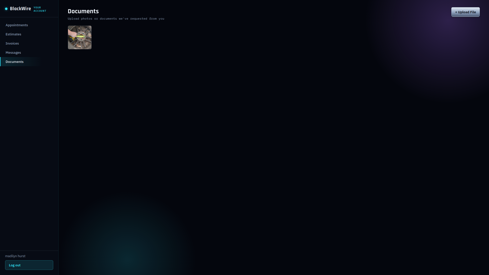

# BlackWire FSM 

A self-hosted field service management app for small electrical/HVAC/plumbing/handyman
contractors.



## What's included

**(Core)**
- **Auth**: JWT-based login, bcrypt password hashing, rate-limited login endpoint.
- **RBAC**: Admin / Office (Dispatcher) / Technician roles enforced server-side.
- **Customers**: create/search/view, multiple properties per customer (no company required).
- **Properties**: address, access instructions, gate codes, pet notes, per-property job history.
- **Jobs**: full lifecycle status model, technician assignment, status history/audit trail.
- **Scheduling**: day view showing each technician's jobs plus an unassigned-jobs queue.
- **Dashboard**: today's jobs, needs-attention, unassigned, upcoming, recent customers.
- **Audit log**: every create/modify/assign/login is recorded (`audit_logs` table).

**(Field work + admin gaps)**
- **User management**: admin can list users, create them, deactivate/reactivate, and
  reset any user's password from the Users page. Any logged-in user can change their own
  password via `POST /api/auth/me/change-password` (no UI yet).
- **Customer archiving**: soft-delete via Archive/Unarchive history stays intact,
  archived customers drop out of the default customer list.
- **Photos**: technicians upload job photos (before/during/after/general) straight to
  MinIO from the mobile job screen; the UI fetches short-lived signed URLs to display them.
- **Materials**: add/remove parts used on a job, with cost, sale price, and quantity.
- **Time tracking**: start/stop timer per technician per job; office/admin can manually
  adjust entries.
- **Signatures**: canvas-based signature capture (e.g. on job completion), stored as a
  base64 PNG with signer name, timestamp, and IP address.

**(Money)**
- **Estimates**: create from scratch or from a job, editable line items with per-item
  tax toggle, mark as sent, record approval (captures approver name + IP) or decline,
  server-generated PDF. Draft or sent estimates can be reopened and edited (approved
  ones can't  decline first or create a new estimate).
- **Invoices**: create manually or auto-build from a job's logged materials and time
  entries (`POST /invoices/from-job/:jobId`), edit while in draft, mark sent, void,
  server-generated PDF. Sent invoices with no payments recorded yet can be reopened
  and corrected - once a payment exists, void and reissue instead.
- **Payments**: record cash/check/card/ACH/other payments against an invoice; invoice
  status (partially paid / paid) recalculates automatically, and a fully-paid invoice
  flips its linked job to `PAID`.
- **Multiple documents per job**: a job can have any number of estimates and invoices
  over its lifetime (revised estimate, partial invoicing, corrections) they're no
  longer locked to one each.
- **Price book**: admin/office maintain a reusable catalog of materials/services (name,
  cost, sale price, taxable default). It can be pulled into job materials, estimate line
  items, and invoice line items with one click instead of retyping pricing each time.
- **Job status control for admin/office**: a status dropdown on the Job Detail page lets
  admin or office move a job to any status directly  not just what a technician's mobile
  actions produce.
- **Dashboard**: "Estimates awaiting approval," "Unpaid invoices," and "Overdue invoices"
  are now real, live data instead of empty placeholders.

## Fixed

- **Notifications are now opt-in, not automatic.** Scheduling a job, marking it en
  route/completed, sending an estimate/invoice, or recording a payment no longer
  silently fires an email. Instead, Job Detail, Estimate Detail, and Invoice Detail
  each have explicit "Email ___ to Customer" buttons - staff choose exactly when a
  customer gets contacted, not on every internal status change.
- **Multi-role users.** A user can now hold more than one role at once (e.g. a solo
  operator who is Admin, Office, and Technician simultaneously) instead of being
  locked into a single role and having to log out/in to switch hats. The Users page
  uses checkboxes instead of a single dropdown; job/dashboard visibility scoping only
  restricts someone who holds *only* the Technician role  anyone who's also Admin or
  Office keeps full visibility.

**(Communication)**
- **Email**: SMTP-based sending via `nodemailer`. If `SMTP_HOST` is left blank, the
  app doesn't fail  it just logs the notification as "skipped" so you can turn email
  on later without anything breaking in the meantime.
- **SMS**: a pluggable provider interface (`backend/src/lib/sms.ts`) with no vendor
  hard-coded. The default `SMS_PROVIDER=none` cleanly skips SMS and logs why. Adding a
  real provider (Twilio, etc.) later means writing one class and one line in a switch
  statement  nothing else in the app changes.
- **Notifications are opt-in, triggered from a button**: Job Detail has "Email
  Confirmation," "Email Reminder," "Email 'On My Way'," and "Email Completion"
  buttons (admin/office). Estimate/Invoice Detail have "Email ___ to Customer," and
  a paid invoice also gets an "Email Payment Receipt" button. SMS only sends if a
  customer's preferred contact method is "Text" **and** they have a phone number on
  file  email and SMS don't both fire by default. There's no automatic timer for
  reminders yet  that needs a background job runner (Redis-backed queue), which is
  listed under Phase 6 in the roadmap rather than bolted on here.
- **Email Templates page** (admin only): edit the subject/HTML body/SMS text for any
  of the 7 built-in templates. Editing a template never gets silently overwritten 
  defaults are only inserted if a template with that key doesn't exist yet.
- **Notification Log page** (admin only): every send attempt  sent, failed, or
  skipped - with the reason, so "why didn't the customer get an email" has a real
  answer instead of a black box.

**(Customer Portal)**
- **Separate customer login** at `/portal/login`  completely different auth scheme
  from staff accounts (`backend/src/middleware/portalAuth.ts`), so a customer token
  can never be valid on a staff route or vice versa. Staff invite a customer from the
  Customer Detail page ("Send Portal Invite"); the customer gets an emailed link
  (`/portal/accept-invite?token=...`, valid 48 hours) to set their own password.
- **Appointments**: customers see upcoming and past service at their properties -
  status, scheduled time, assigned technician, and any customer-visible notes.
  Internal notes, material costs, and labor rates are never exposed.

  
- **Estimates**: customers can view and self-approve or decline (typing their name
  counts as an electronic signature, IP-logged) - the same approval path staff use
  internally, so approvals are consistent either way. PDF download included.

  
- **Invoices**: customers see balance due and payment history, with PDF download
  (including any signature captured on the job, same as the staff view).

  
- **"Pay Invoice"**: with no payment processor configured (the default -
  `PAYMENT_PROVIDER=none`), clicking Pay never fakes a charge. It tells the customer
  online payment isn't set up yet and drops a message in the office inbox so a human
  follows up. A real processor (Stripe, etc.) can be added later by implementing
  `PaymentProvider` in `backend/src/lib/paymentProvider.ts` - nothing else changes.
- **Messages**: a simple two-way thread per customer. Customers message from the
  portal; staff see every conversation in a new **Messages** inbox (unread counts,
  most recent first) and reply from the customer's page.
  
- **Document/photo upload**: customers can upload files (e.g. something office asked
  for) straight to MinIO from the portal. Staff view them from the customer's page
  ("Documents" link) read-only gallery with download links.
 
  
- **Message threads refresh automatically** (polling every 10–15s) on both the portal
  and staff sides, with a note that replies work like email rather than instant chat 
  no more needing a manual page reload to see a new message.

**(Settings, Reports, Recurring Jobs, Light/Dark Mode)**
- **Settings page** (admin only): company name/address/phone/email, default labor rate,
  default tax rate, and job/estimate/invoice numbering prefixes are now editable in the
  app instead of living in `.env`. On first boot after upgrading, whatever was in your
  `.env` gets copied in automatically  editing `.env` after that point no longer does
  anything for these values.
- **Reports page** (admin/office): revenue collected (cash-basis, from recorded
  payments), outstanding/paid/overdue invoice totals, jobs created vs. completed,
  jobs-and-hours by technician, estimate win/loss rate, and top materials used by
  value - all with a date-range filter.
- **Recurring jobs**: set a job to repeat (weekly/biweekly/monthly/quarterly/
  semi-annually/annually) from its detail page. A lightweight in-process scheduler
  checks every 30 minutes and generates the next occurrence automatically, then
  schedules the one after that.
- **Optional automatic reminders**: Settings has a toggle (off by default, respecting
  the earlier feedback that notifications should be opt-in) to auto-send the
  appointment reminder template a configurable number of hours before each job 
  handled by the same scheduler.
- **Light/dark mode**: (--UPDATE: temporarily disabled ) a toggle in the sidebar (both staff app and customer portal)
  switches themes instantly and remembers your choice. Defaults to dark to match the
  BlackWire brand.


## Roles in practice

Roles are additive  a user can hold any combination of Admin, Office, and Technician
at once. This matters most for a solo operator or very small team: one person can be
Admin + Office + Technician on a single account instead of juggling separate logins.
Job/dashboard "assigned jobs only" scoping only applies to someone who holds *just*
Technician  add Admin or Office alongside it and they see everything.

- **Admin**: everything Office can do, plus user management, price book, email
  templates, notification log, and full override of job status regardless of what a
  technician has set.
- **Office/Dispatcher**: customers, properties, jobs, scheduling, technician assignment,
  estimates, invoices, payments, price book, and job status changes. This is the
  primary desk/back-office role  most day-to-day admin work should happen here rather
  than requiring an Admin login.
- **Technician**: their assigned jobs only  status updates via the large mobile action
  buttons, photos, materials, time tracking, signatures.


## Quick start

1. Copy the environment template and fill in real secrets:
   ```bash
   cp .env.example .env
   ```
   Generate strong random values for `POSTGRES_PASSWORD`, `MINIO_ROOT_PASSWORD`, and
   `JWT_SECRET`  e.g. `openssl rand -hex 32`.

2. **If you ran an earlier version of this app**: run `docker compose down -v` first to
   wipe the old database volume. An earlier build of this project shipped without a real
   `prisma/migrations` folder, so if you got the app running by hand-running
   `prisma migrate dev --name init`, your database's migration history won't match what's
   now baked into the image. Starting clean avoids a migration conflict on next boot.

3. Build and start everything:
   ```bash
   docker compose up -d --build
   ```
   The backend container now runs `prisma migrate deploy` against a real, committed
   migration history (`backend/prisma/migrations/`), so this step alone creates all
   tables - no more manual `migrate dev` step required.

4. Load demo data (10 customers, properties, 20+ jobs, 3 technicians):
   ```bash
   docker compose exec backend npm run seed
   ```
   This creates:
   - `admin@example.com` / `ChangeMe123!` (Administrator)
   - `dispatch@example.com` / `ChangeMe123!` (Office/Dispatcher)
   - `john@example.com`, `mike@example.com`, `sam@example.com` / `ChangeMe123!` (Technicians)

   **Change these passwords immediately**  go to the Users page as admin and use
   "Reset password" on each seed account, or deactivate them and create real ones.

5. Open the app:
   - Frontend: `http://localhost:8080` (or `http://<your-LAN-IP>:8080` from another device)
   - Backend health check: `http://localhost:3001/api/health`
   - MinIO console: `http://localhost:9001`

## Accessing from other devices on your LAN (for technician phones)

Docker Compose binds the frontend and backend to all interfaces by default, so any
device on the same network can reach the app at `http://<server-LAN-IP>:8080`.

1. Find your server's LAN IP (`ip addr` on Linux, `ipconfig` on Windows).
2. Set `PUBLIC_API_URL=http://<server-LAN-IP>:3001` in `.env` **before** building the
   frontend - it's baked in at build time as `VITE_API_URL`.
3. Rebuild the frontend: `docker compose up -d --build frontend`.
4. On a technician's phone, open `http://<server-LAN-IP>:8080` and log in.

For anything beyond your local network (remote technicians, a customer portal reachable
from the internet), put a reverse proxy with TLS (Caddy, nginx + certbot, or Traefik) in
front of these services - that's outside this phase's scope but doesn't require touching
the app itself.

## User management

- **Create a user**: Users page → "+ New User" (admin only).
- **Reset a password**: Users page → "Reset password" next to any user.
- **Deactivate/reactivate**: Users page → toggle button. Deactivated users can't log in
  but their historical jobs, audit entries, and time entries are preserved (users are
  never hard-deleted).
- **First administrator** (if you skip seeding): create one directly in the database:
  ```bash
  docker compose exec backend node -e "
  const { PrismaClient } = require('@prisma/client');
  const bcrypt = require('bcryptjs');
  const prisma = new PrismaClient();
  (async () => {
    const passwordHash = await bcrypt.hash('YourStrongPassword!', 12);
    await prisma.user.create({
      data: { email: 'you@example.com', passwordHash, firstName: 'You', lastName: 'Admin', role: 'ADMIN' }
    });
    console.log('Admin created.');
  })();
  "
  ```

## Fixed 

- **PDF "Not authenticated" error**: PDF links now fetch through the authenticated API
  client and open as a local blob URL, instead of a plain `<a href>` that skipped the
  Authorization header entirely.
- **"One shot" estimates/invoices**: draft documents are fully editable; sent documents
  can be reopened (with guardrails - see above) instead of being permanently locked
  after creation.
- **Admin job control**: admin/office now have a direct status dropdown on the Job Detail
  page rather than being limited to whatever a technician's mobile actions produced.

## Company info on PDFs

**this is managed in-app**: log in as admin and go to **Settings**.
On first boot after upgrading, whatever was in `COMPANY_NAME`/`COMPANY_ADDRESS`/
`COMPANY_PHONE`/`COMPANY_EMAIL`/`DEFAULT_LABOR_RATE` gets copied into the database
automatically. After that, editing `.env` no longer has any effect on these values 
use the Settings page instead.

## Backup and restore

**Backup** (Postgres data + MinIO documents):
```bash
docker compose exec postgres pg_dump -U fsm fsm > backup_$(date +%F).sql
docker compose exec minio sh -c "tar czf - /data" > minio_backup_$(date +%F).tar.gz
```

**Restore**:
```bash
cat backup_2026-08-23.sql | docker compose exec -T postgres psql -U fsm fsm
```
For MinIO, stop the container, extract the tarball into the `minio_data` volume's mount
point, and restart.

## Updating the application

```bash
git pull                # or copy in new source
docker compose up -d --build
```
Migrations run automatically on backend container start (`prisma migrate deploy`).
Always back up the database before updating.

## Viewing logs

```bash
docker compose logs -f backend
docker compose logs -f frontend
docker compose logs -f postgres
```

## Project layout

```
docker-compose.yml
.env.example
backend/          Node + TypeScript + Express + Prisma API
  prisma/schema.prisma       Relational schema
  prisma/migrations/         Committed migration history (init + phase2 signatures)
  prisma/seed.ts             Demo data generator
  src/routes/                auth, customers, properties, jobs, dashboard,
                              materials, timeEntries, photos, signatures,
                              estimates, invoices, payments, pricebook,
                              emailTemplates, notificationLog, portalAuth,
                              portal, messagesInbox, settings, reports
  src/lib/storage.ts         MinIO/S3 client for photo uploads (internal + public endpoints)
  src/lib/pdf.ts             Estimate/invoice PDF generation (pdfkit), incl. signatures
  src/lib/money.ts           Shared subtotal/tax/discount/total math
  src/lib/mailer.ts          SMTP sending (nodemailer), no-ops cleanly if unconfigured
  src/lib/sms.ts             Pluggable SMS provider interface (no vendor hard-coded)
  src/lib/paymentProvider.ts Pluggable payment provider interface (no vendor hard-coded)
  src/lib/notify.ts          Renders a template and sends+logs it for a customer
  src/lib/templates.ts       Default email/SMS template content + boot-time seeding
  src/lib/estimateApproval.ts Shared approve-estimate logic (staff + portal both use it)
  src/lib/settings.ts        DB-backed settings singleton, seeded from .env on first boot
  src/lib/scheduler.ts       In-process timer: recurring job generation + optional reminders
  src/middleware/auth.ts     Staff JWT verification + role-based route guards
  src/middleware/portalAuth.ts  Customer JWT verification - fully separate token scheme
frontend/         React + TypeScript + Vite
  src/pages/                 Login, Dashboard, Customers, CustomerDetail, Jobs,
                              JobDetail, Schedule, Users, Estimates, EstimateDetail,
                              Invoices, InvoiceDetail, Pricebook, EmailTemplates,
                              NotificationLog, MessagesInbox, CustomerMessages,
                              CustomerDocuments, Settings, Reports
  src/theme.ts                Light/dark theme persistence (localStorage + data-theme attr)
  src/components/ThemeToggle.tsx  Shared toggle used in both staff and portal sidebars
  src/portal/                Customer-facing portal app: its own API client, auth
                              context, layout, login/invite pages, and views for
                              appointments, estimates, invoices, messages, documents
  src/components/            Layout, StatusBadge, SignaturePad, LineItemEditor
  src/styles.css             BlackWire FSM dark theme (CSS variables)
```


## Setting up real email/SMS

**Email**: fill in `SMTP_HOST`, `SMTP_PORT`, `SMTP_USER`, `SMTP_PASSWORD`, and `SMTP_FROM`
in `.env`, then `docker compose up -d backend` (no rebuild needed  these are runtime env
vars). Any SMTP provider works (Gmail app password, SendGrid, Postmark, your own mail
server, etc.).

**SMS**: currently a no-op by design (`SMS_PROVIDER=none`) - see  notes above for
what's needed to wire in a real provider.

**Troubleshooting**: check Settings → Notification Log as admin. "Skipped" means nothing's
configured yet (not an error); "Failed" means SMTP rejected the send - the error message
is usually specific enough to fix (bad credentials, wrong port, etc.).

## Setting up the customer portal

1. Make sure `PUBLIC_APP_URL` in `.env` points to wherever people will actually load
   the frontend (LAN IP or domain) - it's baked into the invite email link.
2. Configure SMTP (see above) so invite emails actually send - without it, the invite
   still "sends" but just logs as skipped in the Notification Log, and you'd have to
   manually hand the customer their portal URL.
3. From a customer's detail page (staff view), click **Send Portal Invite**. Requires
   an email on file.
4. The customer clicks the emailed link, sets a password, and lands in their portal
   at `/portal`.

**Payments**: `PAYMENT_PROVIDER=none` by default  the portal's Pay button notifies
the office instead of processing a real charge. See Phase 5 notes above for wiring in
a real processor later.

## Fixed / added 

- **Invoice/estimate PDF layout bug fixed and verified**: wrapped line-item
  descriptions no longer cause the totals, signature, or notes/terms sections to
  overlap. The PDF generator now tracks a single vertical cursor, measures real
  rendered text/image heights, and paginates properly (with the line-item table
  header repeating on subsequent pages) instead of  running off the page.
- **Pagination on data-heavy pages**: Customers, Jobs, Estimates, Invoices, and the
  Notification Log now page results from the database (default 50 per page) instead
  of loading everything at once  this keeps the app fast as your data grows.
- **Mobile-responsive navigation**: the sidebar collapses into a hamburger-menu
  drawer on narrow screens (staff app and customer portal both), instead of
   eating ~60% of a phone's screen width.
- **Scrollable tables**: wide data tables scroll horizontally on narrow screens
  instead of squishing or clipping.
- **CSV import/export**: Customers, Jobs, and the Price Book support both import and
  export. Invoices support export only invoice import is intentionally not
  offered, since a bad import could corrupt  financial records; see `MANUAL.md`
  for exact column formats.
- **`MANUAL.md`**: a full beginner-oriented installation and usage guide, written for
  people who've never run a self-hosted Docker app before  this project's README
  stays technical/reference-focused, while `MANUAL.md` is the "read this first" guide
  for less experienced self-hosters.

## Roadmap

- **Job status customization** (see deferral note above).
- **Drag-and-drop scheduling calendar** (see deferral note above).
- **accessibility pass** 
- **Distributed background job queue** if ever running multiple backend replicas
  (see deferral note above)Redis is already in the stack for this.
- A staff-side UI for viewing customer-uploaded portal documents was added; further
  document management (attaching files to jobs/estimates/invoices directly, per the
  original spec) hasn't been built.
- Multi-currency, multi-location, and membership/service-agreement features from the
  original "Future Architecture" list remain unbuilt
  ## ☕ Support the Project

If you find this project useful and want to support its development, you can buy me a coffee!

[☕ Buy Me a Coffee](https://buymeacoffee.com/blackwireco)
